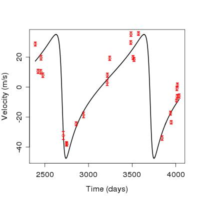

Here is some information about a selection of my publications.

## Lentati et al, 2013, *Hyper-efficient model-independent Bayesian method for the analysis of pulsar timing data*

<a href="http://arxiv.org/abs/1210.3578" class="btn btn-info">ArXiv</a> 

A new model-independent method is presented for the analysis of pulsar timing data and the estimation of the spectral properties of an isotropic gravitational wave background (GWB). Taking a Bayesian approach, we show that by rephrasing the likelihood we are able to eliminate the most costly aspects of computation normally associated with this type of data analysis. When applied to the International Pulsar Timing Array Mock Data Challenge data sets this results in speedups of approximately 2-3 orders of magnitude compared to established methods, in the most extreme cases reducing the run time from several hours on the high performance computer “DARWIN” to less than a minute on a normal work station. Because of the versatility of this approach, we present three applications of the new likelihood. In the low signal-to-noise regime we sample directly from the power spectrum coefficients of the GWB signal realization. In the high signal-to-noise regime, where the data can support a large number of coefficients, we sample from the joint probability density of the power spectrum coefficients for the individual pulsars and the GWB signal realization using a “guided Hamiltonian sampler” to sample efficiently from this high-dimensional (˜1000) space. Critically in both these cases we need make no assumptions about the form of the power spectrum of the GWB, or the individual pulsars. Finally, we show that, if desired, a power-law model can still be fitted during sampling. We then apply this method to a more complex data set designed to represent better a future International Pulsar Timing Array or European Pulsar Timing Array data release. We show that even in challenging cases where the data features large jumps of the order 5 years, with observations spanning between 4 and 18 years for different pulsars and including steep red noise processes we are able to parametrize the underlying GWB signal correctly. Finally we present a method for characterizing the spatial correlation between pulsars on the sky, making no assumptions about the form of that correlation, and therefore providing the only truly general Bayesian method of confirming a GWB detection from pulsar timing data.

## Abott et al, 2012, *First SN Discoveries from the Dark Energy Survey*

<a href="http://adsabs.harvard.edu/abs/2012ATel.4668....1A" class="btn btn-info">NASA Ads</a> 

The Dark Energy Survey (DES) report the discovery of the first set of supernovae (SN) from the project. Images were observed as part of the DES Science Verification phase using the newly-installed 570-Megapixel Dark Energy Camera on the CTIO Blanco 4-m telescope by observers J. Annis, E. Buckley-Geer, and H. Lin. SN observations are planned throughout the observing campaign on a regular cadence of 4-6 days in each of the ten 3-deg2 fields in the DES griz filters.

## Kitching, Balan et al., 2012, *Image analysis for cosmology: results from the GREAT10 Galaxy Challenge*

<a href="http://arxiv.org/abs/1202.5254" class="btn btn-info">ArXiv</a> <a href="http://great10.pbworks.com/w/page/1911054/FrontPage" class="btn btn-success">Challenge Website</a>

In this paper we present results from the weak lensing shape measurement GRavitational lEnsing Accuracy Testing 2010 (GREAT10) Galaxy Challenge. This marks an order of magnitude step change in the level of scrutiny employed in weak lensing shape measurement analysis. We provide descriptions of each method tested and include 10 evaluation metrics over 24 simulation branches. GREAT10 was the first shape measurement challenge to include variable fields; both the shear field and the Point Spread Function (PSF) vary across the images in a realistic manner. The variable fields enable a variety of metrics that are inaccessible to constant shear simulations including a direct measure of the impact of shape measurement inaccuracies, and the impact of PSF size and ellipticity, on the shear power spectrum. To assess the impact of shape measurement bias for cosmic shear we present a general pseudo-Cl formalism, that propagates spatially varying systematics in cosmic shear through to power spectrum estimates. We also show how one-point estimators of bias can be extracted from variable shear simulations. The GREAT10 Galaxy Challenge received 95 submissions and saw a factor of 3 improvement in the accuracy achieved by shape measurement methods. The best methods achieve sub-percent average biases. We find a strong dependence in accuracy as a function of signal-to-noise, and indications of a weak dependence on galaxy type and size. Some requirements for the most ambitious cosmic shear experiments are met above a signal-to-noise ratio of 20. These results have the caveat that the simulated PSF was a ground-based PSF. Our results are a snapshot of the accuracy of current shape measurement methods and are a benchmark upon which improvement can continue. This provides a foundation for a better understanding of the strengths and limitations of shape measurement methods.

## Hollis, Balan, Lever and Lahav, 2012, *A uniformly derived catalogue of exoplanets from radial velocities*

<a href="http://arxiv.org/abs/1201.0668" class="btn btn-info">ArXiv</a> <a href="http://zuserver2.star.ucl.ac.uk/~lahav/exofit.html" class="btn btn-success">Download ExoFit</a>

A new catalogue of extrasolar planets is presented by re-analysing a selection of published radial velocity data sets using EXOFIT. All objects are treated on an equal footing within a Bayesian framework to give orbital parameters for 94 exoplanetary systems. Model selection (between one- and two-planet solutions) is then performed using both a visual flagging method and a standard chi-square analysis, with agreement between the two methods for 99 per cent of the systems considered. The catalogue is to be made available online, and this 'proof of concept' study may be maintained and extended in the future to incorporate all systems with publicly available radial velocity data, as well as transit and microlensing data.

## Balan and Lahav, 2011, *EXOFIT: Bayesian Estimation of Orbital Parameters of Extrasolar Planets*

<a href="http://adsabs.harvard.edu/abs/2011ASPC..450..147B" class="btn btn-info">NASA Ads</a> <a href="http://zuserver2.star.ucl.ac.uk/~lahav/exofit.html" class="btn btn-success">Download ExoFit</a>

We introduce EXOFIT, a Bayesian tool for estimating orbital parameters of extra-solar planets from radial velocity measurements. EXOFIT can search for either one or two planets at present. EXOFIT employs Markov Chain Monte Carlo method implemented in an object oriented manner. As an example we re-analyze the orbital solution of HD155358b and the results are compared with that of the published orbital parameters. In order to check the agreement of the EXOFIT orbital parameters with the published ones we examined radial velocity data of 30 stars taken randomly from www.exoplanet.eu. We show that while orbital periods agree in both methods, EXOFIT prefers lower eccentricity solutions for planets with higher (e ≥ 0.5) orbital eccentricities.

## Feroz, Balan and Hobson, 2011, *Bayesian evidence for two companions orbiting HIP 5158*

<a href="http://arxiv.org/abs/1105.1150" class="btn btn-info">ArXiv</a> 

We present results of a Bayesian analysis of radial velocity data for the star HIP 5158, confirming the presence of two companions and also constraining their orbital parameters. Assuming Keplerian orbits, the two-companion model is found to be e48 times more probable than the one-planet model, although the orbital parameters of the second companion are only weakly constrained. The derived orbital periods are 345.6 ± 2.0 and 9017.8 ± 3180.7 d, respectively, and the corresponding eccentricities are 0.54 ± 0.04 and 0.14 ± 0.10. The limits on planetary mass (m sin i) and semimajor axis are (1.44 ± 0.14MJ, 0.89 ± 0.01 au) and (15.04 ± 10.55MJ, 7.70 ± 1.88 au), respectively. Owing to the large uncertainty on the mass of the second companion, we are unable to determine whether it is a planet or a brown dwarf. The remaining 'noise' (stellar jitter) unaccounted for by the model is 2.28 ± 0.31 m s-1. We also analysed a three-companion model, but found it to be e8 times less probable than the two-companion model.

## Hollis, Balan and Lahav, 2011, *ExoFit - Characterising Orbits the Bayesian Way*

<a href="http://adsabs.harvard.edu/abs/2011ESS.....2.2007H" class="btn btn-info">NASA Ads</a> <a href="http://zuserver2.star.ucl.ac.uk/~lahav/exofit.html" class="btn btn-success">Download ExoFit</a>

Over 500 exoplanets have now been detected using the radial velocity technique, and various methods have been adopted to estimate their orbital parameters. On their own, or combined with data from transits, the results are used to characterise planets and their environments, and statistically to address gaps in the current understanding of planetary formation and evolution. With such an abundance of data, the need is obvious for new techniques to deal with the statistics in a rigorous and systematic fashion, and to constrain the orbital parameter space in order to push the search for new and ever smaller exoplanets.
We at UCL are developing methods borrowed from cosmology to tackle this problem in a Bayesian framework. We use the ExoFit code (Balan & Lahav 2009), utilising Markov Chain Monte Carlo (MCMC) simulations with the Metropolis-Hastings algorithm, to determine the orbital characteristics of planetary systems from radial velocity measurements. We present here the result of the application of ExoFit to the publicly-available data for over 100 stars known to host planets, approximately a quarter of the known population of planetary systems. This results in a database of uniformly-derived orbital parameters, in addition to some surprising differences between some published orbital solutions and the statistical distribution of ExoFit parameters. In addition to developments on the code (fitting for more planets, dealing with resonances etc.), this work naturally leads on to the inclusion of more planets as more data become available, resulting in an ever more comprehensive database of uniformly-derived parameters for known planetary systems.

## Feroz, Balan and Hobson, 2011, *Detecting extrasolar planets from stellar radial velocities using Bayesian evidence*

<a href="http://arxiv.org/abs/1012.5129" class="btn btn-info">ArXiv</a> 

Stellar radial velocity (RV) measurements have proven to be a very successful method for detecting extrasolar planets. Analysing RV data to determine the parameters of the extrasolar planets is a significant statistical challenge owing to the presence of multiple planets and various degeneracies between orbital parameters. Determining the number of planets favoured by the observed data is an even more difficult task. Bayesian model selection provides a mathematically rigorous solution to this problem by calculating marginal posterior probabilities of models with different number of planets, but the use of this method in extrasolar planetary searches has been hampered by the computational cost of the evaluating Bayesian evidence. None the less, Bayesian model selection has the potential to improve the interpretation of existing observational data and possibly detect yet undiscovered planets. We present a new and efficient Bayesian method for determining the number of extrasolar planets, as well as for inferring their orbital parameters, without having to calculate directly the Bayesian evidence for models containing a large number of planets. Instead, we work iteratively and at each iteration obtain a conservative lower limit on the odds ratio for the inclusion of an additional planet into the model. We apply this method to simulated data sets containing one and two planets and successfully recover the correct number of planets and reliable constraints on the orbital parameters. We also apply our method to RV measurements of HD 37124, 47 Ursae Majoris and HD 10180. For HD 37124, we confirm that the current data strongly favour a three-planet system. We find strong evidence for the presence of a fourth planet in 47 Ursae Majoris, but its orbital period is suspiciously close to 1 yr, casting doubt on its validity. For HD 10180 we find strong evidence for a six-planet system.

## Balan, Lever and Lahav, 2010, *Uniformly Derived Orbital Parameters of Exo-planets using ExoFit*

<a href="http://adsabs.harvard.edu/abs/2010ASPC..430..122B" class="btn btn-info">NASA Ads</a> <a href="http://zuserver2.star.ucl.ac.uk/~lahav/exofit.html" class="btn btn-success">Download ExoFit</a>

We present the results from a new systematic study of the radial velocity data of more than 200 planets using the Keplerian orbital fitting program EXOFIT. Based on a Bayesian framework, EXOFIT uses Markov Chain Monte Carlo method to simulate the full posterior distribution of the orbital parameters of extrasolar planets. We discuss the disparity in the eccentricity values obtained by EXOFIT with the published values and the possible reasons for the lower estimates of eccentricity obtained by the EXOFIT. The full details of this work, including an online catalogue of exo-planets with the posterior distributions and the radial velocity plots will appears in Balan, Lever and Lahav (in preparation).

## Bridle, Balan et al., 2010, *Results of the GREAT08 Challenge: an image analysis competition for cosmological lensing*

<a href="http://arxiv.org/abs/0908.0945" class="btn btn-info">ArXiv</a> <a href="http://www.great08challenge.info" class="btn btn-success">Challenge Website</a>

We present the results of the Gravitational LEnsing Accuracy Testing 2008 (GREAT08) Challenge, a blind analysis challenge to infer weak gravitational lensing shear distortions from images. The primary goal was to stimulate new ideas by presenting the problem to researchers outside the shear measurement community. Six GREAT08 Team methods were presented at the launch of the Challenge and five additional groups submitted results during the 6-month competition. Participants analyzed 30 million simulated galaxies with a range in signal-to-noise ratio, point spread function ellipticity, galaxy size and galaxy type. The large quantity of simulations allowed shear measurement methods to be assessed at a level of accuracy suitable for currently planned future cosmic shear observations for the first time. Different methods perform well in different parts of simulation parameter space and come close to the target level of accuracy in several of these. A number of fresh ideas have emerged as a result of the Challenge including a re-examination of the process of combining information from different galaxies, which reduces the dependence on realistic galaxy modelling. The image simulations will become increasingly sophisticated in future GREAT Challenges, meanwhile the GREAT08 simulations remain as a benchmark for additional developments in shear measurement algorithms.

## Balan & Lahav, 2009, *ExoFit: Orbital Parameters of Extra-solar Planets from Radial Velocities*

<a href="{{ site.url }}/theme-setup/" class="btn btn-info">ArXiv</a> <a href="http://zuserver2.star.ucl.ac.uk/~lahav/exofit.html" class="btn btn-success">Download ExoFit</a>

Retrieval of orbital parameters of extrasolar planets poses considerable statistical challenges.Due to sparse sampling, measurement errors, parameters degeneracy and modelling limitations, there are no unique values of basic parameters, such as period and eccentricity. Here, we estimate the orbital parameters from radial velocity data in a Bayesian framework by utilizing Markov Chain Monte Carlo (MCMC) simulations with the Metropolis-Hastings algorithm. We follow a methodology recently proposed by Gregory and Ford. Our implementation of MCMC is based on the object-oriented approach outlined by Graves. We make our resulting code, [ExoFit](http://zuserver2.star.ucl.ac.uk/~lahav/exofit.html), publicly available with this paper. It can search for either one or two planets as illustrated on mock data. As an example we re-analysed the orbital solution of companions to HD 187085 and HD 159868 from the published radial velocity data. We confirm the degeneracy reported for orbital parameters of the companion to HD 187085, and show that a low-eccentricity orbit is more probable for this planet. For HD 159868, we obtained slightly different orbital solution and a relatively high 'noise' factor indicating the presence of an unaccounted signal in the radial velocity data. ExoFit is designed in such a way that it can be extended for a variety of probability models, including different Bayesian priors.

# Bridle et al., 2009, *Handbook for the GREAT08 Challenge: An image analysis competition for cosmological lensing*

<a href="http://arxiv.org/abs/0802.1214" class="btn btn-info">ArXiv</a> <a href="https://bitbucket.org/sarah_bridle/great08_images" class="btn btn-success">Download Code</a>

The GRavitational lEnsing Accuracy Testing 2008 (GREAT08) Challenge focuses on a problem that is of crucial importance for future observations in cosmology. The shapes of distant galaxies can be used to determine the properties of dark energy and the nature of gravity, because light from those galaxies is bent by gravity from the intervening dark matter. The observed galaxy images appear distorted, although only slightly, and their shapes must be precisely disentangled from the effects of pixelisation, convolution and noise. The worldwide gravitational lensing community has made significant progress in techniques to measure these distortions via the Shear TEsting Program (STEP). Via STEP, we have run challenges within our own community, and come to recognise that this particular image analysis problem is ideally matched to experts in statistical inference, inverse problems and computational learning. Thus, in order to continue the progress seen in recent years, we are seeking an infusion of new ideas from these communities. This document details the GREAT08 Challenge for potential participants. Please visit www.great08challenge.info for the latest information.
